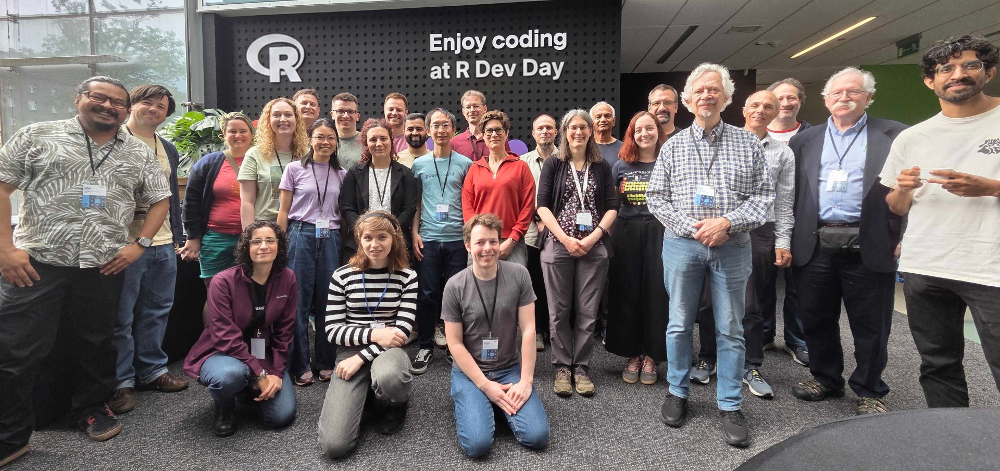

I recently made my first contribution to the R core language itself, fixing a bug I'd first encountered a few months ago while creating the [vecvec](https://pkg.mitchelloharawild.com/vecvec/) R package. The absurdity of the bug caught my attention, and I immediately knew I wanted to investigate and fix it at the upcoming [useR! 2026](https://user2026.r-project.org/) [R Dev Day](https://contributor.r-project.org/events/r-dev-days/).

The bug: `seq.int(along.with = NULL)` returns a *massive* sequence, even though `length(NULL)` is 0. On my Linux installation it produces a sequence of more than **100 trillion** elements! Worse still, this is a silent error and the length seems to vary on every computer and R version -- how puzzling!

```r
seq(along.with = NULL)
#> integer(0)

seq.int(along.with = NULL)
#> [1] 1 2 3 4 5 6 ... [truncated] ... 101689002302752
```

::: {.callout-note}
## Simple sequences

`seq.int()` is a faster, more primitive version of `seq()`.  
It's particularly nice for performance in R packages.
:::

The fix was simply making seven letters lowercase and adding a few unit tests, but the debugging process (and R Dev Day experience) is a story worth telling.

## R Dev Days

R Dev Days bring new and experienced R contributors together for a day of working directly on R itself. It's a great opportunity to learn about R's internals, and contribute to the language with the support of R core members and regular contributors. The day is structured around small teams working on selected issues from the [project board](https://github.com/orgs/r-devel/projects/12).

This dev day was organised by [Heather Turner](https://github.com/hturner) and [Ella Kaye](https://github.com/EllaKaye), who prepared the list of issues and guided us through setting up a development environment for R - a big thanks to them for making R core contributions approachable.

::: {.callout-tip}
## Want to contribute to R?

The [R Development Guide](https://contributor.r-project.org/rdevguide) is worth a read - it covers everything from setting up a build environment to the etiquette of submitting a patch.
:::

## Getting started

Recruiting a small team was easy, [Balasubramanian Narasimhan](https://github.com/bnaras) and [Henrik Bengtsson](https://github.com/HenrikBengtsson) were immediately intrigued by the one-liner bug and we quickly started testing and theorising what the absurd sequence length could be. Alongside us was R-core developer [Luke Tierney](https://github.com/ltierney), who was just as surprised about the bug in a simple and well-used function (albeit the `along.with` argument is rarely used).

With this being my first contribution to the R language, I wanted to take my time and learn the full process. The first step being reporting the bug on R's bug tracker [Bugzilla](https://bugs.r-project.org/). After Heather set me up with an account, I submitted my first 'problem report' ([PR #19100](https://bugs.r-project.org/show_bug.cgi?id=19100)) with a [minimal reproducible example](https://tidyverse.org/help/#reprex/).

Next was to install R-devel so I'd have the right environment to test and troubleshoot the bug. I chose to install R-devel locally, following the [setup instructions](https://contributor.r-project.org/rdevguide/chapters/getting_started.html) in the R Development Guide. This involved getting the latest R sources from <https://svn.r-project.org/R/trunk/>, installing build dependencies, and then building R with `make`.

::: {.callout-tip}
## Quick start R-devel

I also experimented with using the ready-to-go [r-devel/r-dev-env](https://github.com/r-devel/r-dev-env) codespace, which quickly spins up a containerised R-devel build with VS Code in your browser (no local setup required).

I think this is a great option for the occasional contributor, but I wanted to learn the full process of debugging, modifying and building R locally.
:::

## Debugging

With a development build of R 4.7.0 in hand, the next job was digging into the code of `seq.int()`. 

```r
seq.int
#> function (from, to, by, length.out, along.with, ...)  .Primitive("seq.int")
```

This function is an R 'primitive' - printing it doesn't reveal any clues, since everything is implemented in C. In R's source code, primitives like this are registered in [`names.c`](https://github.com/wch/r-source/blob/e45c090cf82dd726dbfbc9218e14e5799120d8ad/src/main/names.c#L636), which allows us to find the name of its C function: `do_seq` from [`seq.c`](https://github.com/wch/r-source/blob/e45c090cf82dd726dbfbc9218e14e5799120d8ad/src/main/seq.c#L792-L802).

```c
/*
  This is a primitive SPECIALSXP with internal argument matching, implementing

  seq.int(from, to, by, length.out, along.with, ...)

  'along' has to be used on an unevaluated argument, and evalList
  tries to evaluate language objects.
 */
#define FEPS 1e-10
/* to match seq.default */
attribute_hidden SEXP do_seq(SEXP call, SEXP op, SEXP args, SEXP rho)
{
  /* ... code implementing sequences ... */
}
```

Looking into `do_seq()`, there's only [one place](https://github.com/wch/r-source/blob/e45c090cf82dd726dbfbc9218e14e5799120d8ad/src/main/seq.c#L846-L850) where `along.with` (called `along` internally) actually gets used:

```c
lout = XLENGTH(along);
if(One) {
    ans = lout ? seq_colon(1.0, (double)lout, call) : allocVector(INTSXP, 0);
    goto done;
}
```

This narrowed our search to `XLENGTH()`, a macro that reads the length of an R object. When you pass `along.with = NULL`, `along` becomes `R_NilValue`, R's internal representation of `NULL`. So if `length(NULL)` is 0, why isn't `XLENGTH(R_NilValue)` also `0`?

## Fixing R

`XLENGTH()` eventually calls `STDVEC_LENGTH()`, a macro that reads an object's length straight out of a fixed offset in R's internal vector layout. Basically, it assumes the length field always lives at this exact spot in memory, so it just reads it directly. That works perfectly for actual vectors, because vectors *have* a length field at that offset. However non-vectors like `NULL` don't have length fields (nor do functions, symbols, or environments). So `XLENGTH()` ends up reading whatever happens to be at that offset in memory, hence the large and inconsistent sequence lengths.

Fortunately R already has a safer variant of `XLENGTH()` for this, `xlength()`. This function switches on the object's type before reading anything, correctly returning `0` for `NULL` and sensible values for other non-vector types too. The fix was simply:

```diff
- lout = XLENGTH(along);
+ lout = xlength(along);
```

After adding a few unit tests (and running `make check-devel` to test them), I attached the patch to the bug report and it was ready for review. Less than two hours later, Luke Tierney had commited the patch to R-devel r90229 and ported it to R-patched r90230 (it helps that he was working right next to us the whole day answering our questions!).

## The mystery length

So what exactly is sitting in memory at the usual length offset for `NULL`? We theorised (right from the start) that the huge sequence length could relate to a pointer or memory address. To confirm the theory, we used `.Internal(inspect(NULL))` to find more information about `NULL`'s internal representation:

```r
.Internal(inspect(NULL))
#> @5c7c50dc1d20 00 NILSXP g1c0 [MARK,REF(65535)]
```

`5c7c50dc1d20` is the memory address of `NULL` itself, printed in hex. Convert it to decimal, and it matches the exact length that `seq.int(along.with = NULL)` returned on that machine. That's why the sequence length was huge and consistent across calls on the same machine, but different on other machines and R versions.

This also answers why different objects (e.g. the `mean` function) return different lengths, since their memory addresses are different. It also explains why the length didn't correspond to 'round' numbers like `2^32` or `2^64`, which would be more typical of an underflow.

> Good "detective work" -- yes, and of course a bug to be addressed. Thank you Mitchell!  
> *[Martin Maechler](https://github.com/mmaechler)*

## Wrapping up

Huge thanks to everyone at R Dev Day - it was a lot of fun and a great place to make my first contribution to R itself. Some issues only require R knowledge, while others involve delving into R's C code, and there is always a need for translation, documentation, and testing. If you work with R and would like to get involved, you can find [upcoming R Dev Days](https://contributor.r-project.org/events/r-dev-days/#upcoming-events) and apply to participate.

{fig-alt="Group photo of R Dev Day 2026 participants in front of peg board wall with R logo and text 'Enjoy coding at R Dev Day'. There are 26 participants in the photo, with the author Mitchell O'Hara-Wild kneeling in the center of the front row." width=100%}