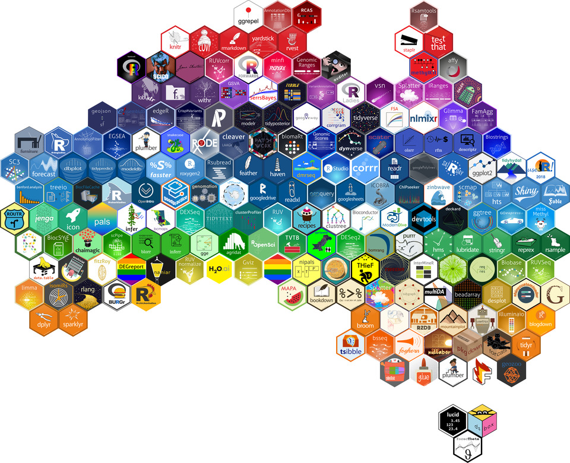

```{r, include=FALSE}
knitr::opts_chunk$set(
  comment = "#>",
  message = FALSE
)

set.seed(71)
```

The hexwall at [useR! 2018](http://user2018.r-project.org/) features roughly 200 contributed R package hexagon stickers. If you've ever had difficulty aligning hexagon stickers in your slides or even on your laptop, you may appreciate the challenge of arranging hundreds of hexagons. Fortunately with R and a little bit of magick, we can substantially simplify this process.

## Collection

Hexagon collection proved to be one of the more time-consuming steps in the project. Without a Comprehensive R Hexagon Repository (CRHR), Di Cook ([\@visnut](https://twitter.com/visnut/)) and I resorted to collecting hexagons via email and promoting the project via twitter.



Our collection efforts were also supported by Rstudio's [hex-stickers](http://github.com/rstudio/hex-stickers) and Bioconductor's [BiocStickers](https://github.com/Bioconductor/BiocStickers) repositories. We opted not to sift through the [hexb.in](http://hexb.in/) library as we wanted the feature wall to feature only R package stickers.

The response to our project has been huge, and we are grateful for everyone who has contributed their stickers.

## hexwall
The hexwall script (available at [mitchelloharawild/hexwall](https://github.com/mitchelloharawild/hexwall)) provides the magick for cleaning, sorting, and arranging hexagons. The function does the following operations using the [ROpenSci magick package](https://github.com/ropensci/magick):

* Load the images
* Make white backgrounds transparent
* Trim images
* Remove bad images (low resolution or incorrect dimensions)
* Arrange the stickers on the canvas

For more details on using magick to arrange hexagons, you can read [arranging hex stickers in R](https://blog.mitchelloharawild.com/blog/hexwall)

## Creating the hex map
To create a hexagon map of Australia, we first need to find a map. I'm using the [GADM](https://gadm.org/) database to give a nice boundary of Australia, which is easily obtainable via the [geodata package](https://github.com/rspatial/geodata) (the raster package's `getData()` used previously has since been removed in favour of geodata).

```{r getAus}
library(tidyverse)
library(sf)
aus <- geodata::gadm(country = "AUS", level = 0, path = tempdir()) %>%
  st_as_sf() %>%
  st_cast("POLYGON") %>%
  st_geometry() %>%
  st_set_crs(NA)

# Keep only the mainland and Tasmania, dropping the many tiny offshore
# islands so the hexagon tiling reflects Australia's overall shape
aus <- aus[order(st_area(aus), decreasing = TRUE)[1:2]]

ggplot() +
  geom_sf(data = st_as_sf(aus))
```

To convert this map into hexagonal coordinates, we can use `sf::st_make_grid()` to lay a hexagonal lattice over the map, keeping only the hexagons that overlap Australia's outline. Through experimentation, a cellsize of 2 is roughly appropriate for the number of hexagons submitted to us. As it is a random process, some repetition may be needed to get the exact number of hexagons on the map with a nice layout.

The mainland and Tasmania are gridded separately, testing overlap against a slightly eroded outline (`st_buffer(land, -0.3)`). This trims the hexagons that would otherwise only just clip the coastline, so the tiling doesn't bridge the Bass Strait gap between the two.

```{r getCoords}
hex_grid <- aus %>%
  map(function(land) {
    grid <- st_make_grid(land, cellsize = 2, square = FALSE)
    grid[st_intersects(grid, st_buffer(land, -0.3), sparse = FALSE)]
  }) %>%
  reduce(c)

hex_points <- st_centroid(hex_grid)
as_tibble(st_coordinates(hex_points))
```

To ensure that we are happy with the hexagon placements, we should view the hexagon grid on a map.

```{r plotHex}
aus_hex <- hex_grid

ggplot() +
  geom_sf(data = st_as_sf(aus)) +
  geom_sf(data = st_as_sf(aus_hex), colour = "blue", fill = NA)
```

Looks great, let's make the map. Using the script from [mitchelloharawild/hexwall](https://github.com/mitchelloharawild/hexwall), we provide:

* A folder containing the hexagon images
* Desired pixel width of each hexagon
* Hexagon coordinates computed above

If there are lot of stickers to position, or the resulting image dimension is large, this may take some time.

```{r hexwall, eval = FALSE}
source("hexwall.R")
hexwall(
  "hexstickers",
  sticker_width = 500,
  coords = st_coordinates(hex_points),
  sort_mode = "colour"
)
```


Beyond that, there were just a few finishing touches needed to add the useR! 2018 logo and text. Hope you all enjoy the 2018 useR! conference :)